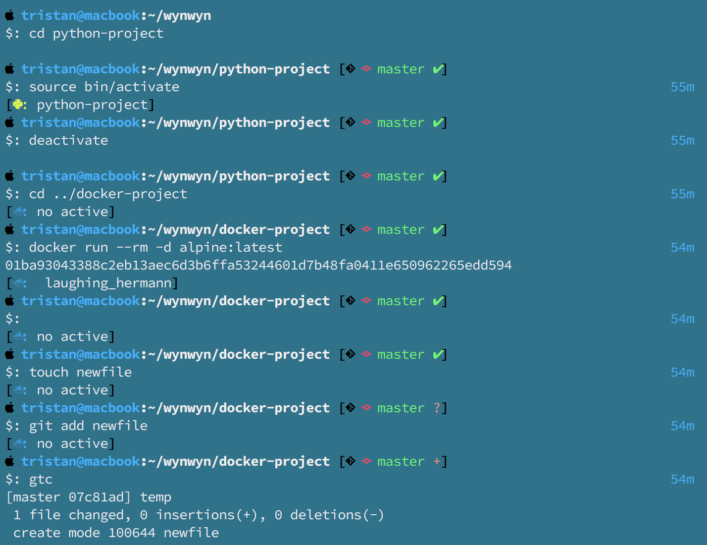
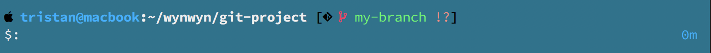
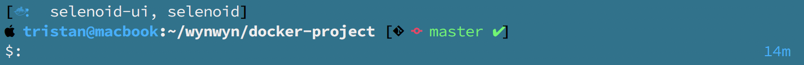
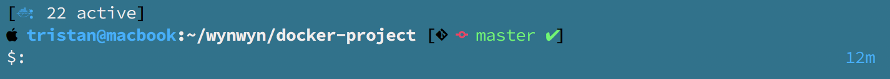
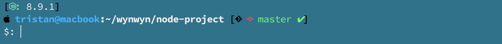
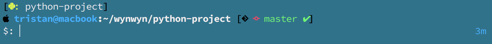
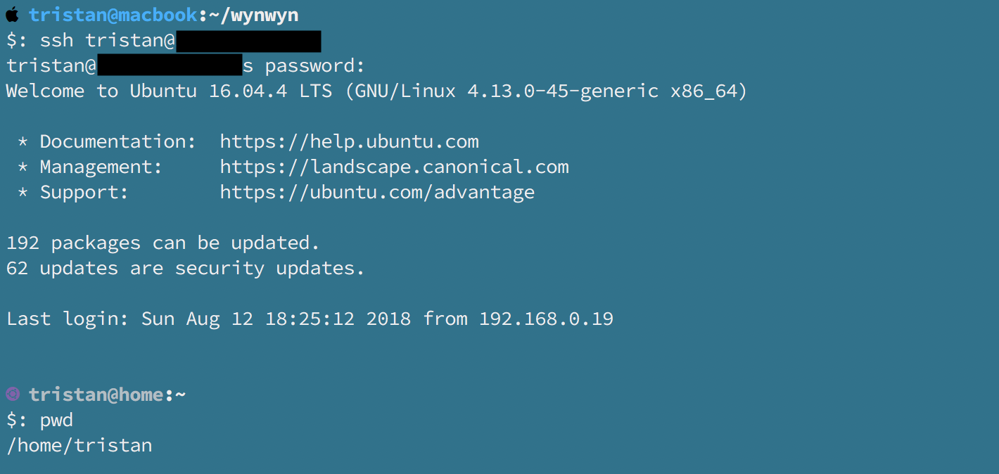
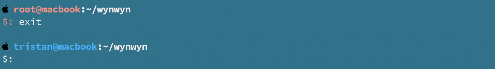

<h1 align="center">wynwyn.zsh-theme</h1>
<p align="center">
  <em>What you need, when you need (it).</em>
</p>

A theme for oh-my-zsh that aims to show you the information you need at the time you need it.
`wynwyn` takes inspiration from the deault theme `avit` and the excellent [Spaceship prompt](https://github.com/denysdovhan/spaceship-prompt). 

## Preview


## Requirements
1. You will need a [Nerd Font](https://github.com/ryanoasis/nerd-fonts) installed for the icons used in the theme to display properly.
Follow the instructions in the Nerd Font projet to install a patched fon't for your terminal.

2. Download the the dev icons associations file from the Nerd Font repo (`bin/scripts/lib/i_dev.sh`), and save it in your local font config directory (`~/.local/share/fonts`).

3. Source the dev icons file in your `.zshrc`.

## Enabling
1. Clone this repository.

2. Create a symlink to the wynwyn.zsh-theme file in `~/.oh-my-zsh/custom/themes/` directory. 
```zsh
ln -s $PWD/wynwyn.zsh-theme ~/.oh-my-zsh/custom/themes/wynwyn.zsh-theme
```
(assuming you are in the directory, so `$PWD` will expand correctly)

3. In your `.zshrc` file, set `ZSH_THEME="wynwyn"`

## Features
This theme currently supports the following features:

### Git status

Shows:
* Branch name
* Icon to show if branch has diverged from it's origin
* Last commit time
* Indicators for different git changes:
	- untracked='?'
	- added='+'
	- modified='!'
	- renamed='>>'
	- deleted='✘'
	- stashed='$'
	- unmerged='='
	- branch_ahead='⇡'
	- branch_behind='⇣'
	- branch_diverged='⇕'

### Docker container list

If you're in a directory that contains a `Dockerfile` or `docker-compose.yml` you will see the docker indicator.
This will display the names of any currently running containers or if there are more than 4 active it will show the number currently running. 


### Node projects

If you're in a directory that contains a `node_modules` directory it will show the current version of node being used.

### Python projects

When you activate a python virtual environment it will show the environment name.

### Operating system icon
Displays an icon specific to the operating system you're currently using.
For example if I ssh into my home PC from my work macbook, my prompt would look like:


Currently supports:
* macOS
* Ubuntu

Note: For this to work you need to have this theme set on the computers you ssh into.

### Root user warning

If you're logged in as the root user, your prompt will keep you reminded.

## Customising
The colours used by this theme have been set to local variables so they can be used in multiple places.
If you want to replace any colours with ones you prefer, you can set your own values in the colour scheme section at the top of the file.

To find the colour codes required you can run the command `spectrum_ls` in your zsh shell which will print out the colour colour codes with text to demonstrate them.

